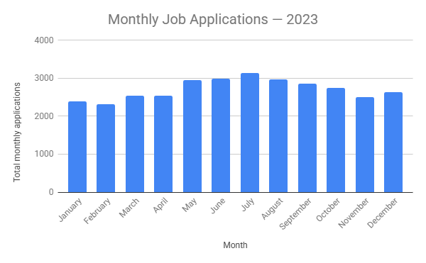

# Job Application Data Analysis

## Overview

This project analyzes job application data over a one-year period to identify monthly application trends and summarize recruiting activity.

## Objective

The analysis answers the following questions:

* How many applications were received each month?
* How many applications were received in total?
* Which month had the lowest number of applications?
* Which month had the highest number of applications?
* What was the average number of applications per month?

## Tools Used

* Google Sheets
* Data organization and cleaning
* Spreadsheet functions
* Data summarization
* Basic data visualization

## Monthly Application Trends

## Analysis

The dataset contains 32,596 job applications recorded over one year.

The data was organized chronologically and a month field was created to group applications by month. Monthly application counts were then calculated using spreadsheet functions including `TEXT` and `COUNTIF`.

Additional functions used include:

* `SUM`
* `MIN`
* `MAX`
* `AVERAGE`

## Key Findings

| Metric                       |           Result |
| ---------------------------- | ---------------: |
| Total applications           |           32,596 |
| Average monthly applications |         2,716.33 |
| Lowest month                 | February — 2,312 |
| Highest month                |     July — 3,138 |

July had the highest application volume, while February had the lowest.

## Business Insight

The monthly pattern suggests that recruiting activity and advertising efforts could potentially be adjusted based on seasonal application volume. Lower-volume periods may present opportunities for increased outreach, while higher-volume periods may require additional recruiting capacity.

## What I Learned

This project helped me practice organizing raw data, creating calculated fields, using spreadsheet functions to summarize data, and interpreting quantitative results to produce a business-oriented insight.

## Project Files

* `job_application_analysis.xlsx` — spreadsheet containing the analysis
* `README.md` — project documentation

